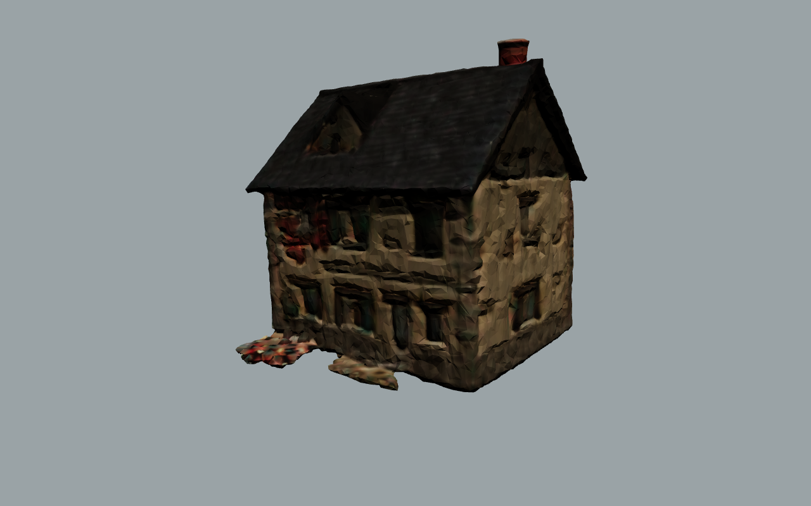

# CoD2 Temalı Bina: Savaşta Hasar Görmüş Normandiya Evi

Unity FPS oyunu için Call of Duty 2 (1944, Carentan) havasında iki katlı bir taş ev. **Hiçbir API anahtarı gerekmez**, her şey yerelde CPU üzerinde çalışır.
İki parçası var:

1. **Prosedürel, oynanabilir bina** (`generator/`): kapılar, merdiven, iç duvarlar ve collider'larla FPS'e hazır OBJ.
2. **[TripoSR](https://github.com/VAST-AI-Research/TripoSR) ile görselden 3D** (`triposr/`): VAST-AI ve Stability AI'nin MIT lisanslı açık kaynak modeli, tek bir görselden dokulu mesh üretir. Binanın render'ı ondan geçirilerek daha organik, el yapımı görünümlü bir dış cephe modeli elde edildi. Bu model arka plan binası ya da uzak bina olarak kullanılabilir.


| Zemin kat | MG yuvası | Üst kat |
|---|---|---|
|  |  |  |

## İçerik

- Ölçüler: 10 m × 8 m taban, 2 kat (kat yüksekliği yaklaşık 3,1 m), sırt yüksekliği yaklaşık 10 m. Birim metre, Y yukarı.
- Kapılar 1,1 m × 2,3 m. Merdiven 16 basamaklı (rıht 19 cm, basamak 31 cm), Unity CharacterController'ın varsayılan step offset değeriyle çıkılabiliyor.
- Hasar: üst kat ön duvarında top mermisi deliği (çıkıntılı tuğlalar, dökülmüş sıva), çatıda delik ve kırık mertekler, tavandan sarkan kırık kirişler, moloz yığınları.
- Detaylar: yeşil Fransız panjurlar (açık, kapalı, kırık), taş köşe blokları, kum torbalı MG yuvası, kum torbası barikatı, sandıklar, devrilmiş masa, baca.
- 11.320 üçgen ve 9 malzeme. Her malzeme ayrı bir alt nesne olarak geliyor: `plaster, brick, stone, wood_floor, wood_dark, shutter_green, slate, burlap, ground`.
- Dokular 512 px, tekrarlanabilir (tileable) ve prosedürel olarak üretildi.

## Unity'ye Kurulum

1. `Unity/Assets/CoD2Building` klasörünü projenizin `Assets/` klasörüne kopyalayın.
2. `Editor/CoD2BuildingImporter.cs` import sırasında şunları otomatik yapar:
   - her alt mesh'e **MeshCollider** ekler (Generate Colliders),
   - dokuları Repeat moduna alır,
   - malzemelere aynı isimli dokuyu bağlar (Built-in `_MainTex` ve URP `_BaseMap` desteklenir).
3. Menüden **Tools → CoD2 → Normandiya Evini Sahneye Ekle**'yi seçin. Ev orijine, static olarak yerleşir.
4. Kendi terrain'inizi kullanacaksanız `ground` alt nesnesini silin.

> Dokular atanmamış görünürse modele sağ tıklayıp **Reimport** yapın. Doku dosyaları modelden önce import edilmiş olmalı.
> Unity OBJ'yi X ekseninde aynalayarak alır, yani top deliği diğer tarafta görünür. Bunun oynanışa bir etkisi yok.

## Yeniden Üretme ve Değiştirme

```bash
pip install numpy pillow trimesh
cd generator
python3 build_house.py --out ../Unity/Assets/CoD2Building/Models --glb-dir ../glb --seed 1944
```

Kat planı, pencere ve kapı açıklıkları ile hasar noktaları `build_house.py` dosyasının başındaki sabitlerde tanımlı (`FRONT`, `BACK`, `SHELL_HOLE`, `STAIR_*` ...). `--seed` değerini değiştirince moloz, kırık tuğla ve kum torbası yerleşimi değişir.

Önizleme render'ları (`npm i three@0.169.0 playwright` gerekir):

```bash
cd generator/preview
node render.mjs ../../glb ../../previews '{"on_cephe":"cam=-13,6,-17,0,3.5,0"}'
```

## TripoSR ile Görselden Bina (API anahtarı yok)



`Unity/Assets/CoD2Building/TripoSR/normandy_house_triposr.obj` dosyası `previews/referans.png` görselinden üretildi. Mesh 40.000 üçgen, 2048 px dokulu, boyutu 9,6 × 10,5 × 9,6 m. Ön cephesi -Z yönüne bakıyor, yani prosedürel evle aynı yönde. Tek parça ve içi dolu olduğu için içine girilemez. Arka plan veya uzak bina olarak kullanmaya uygun.

```bash
cd triposr
./setup.sh                                   # TripoSR'ı klonlar, CPU için PyTorch ve bağımlılıkları kurar (yaklaşık 2 GB)
./run.sh ../previews/referans.png --yaw 90 --out ../Unity/Assets/CoD2Building/TripoSR
./run.sh cod2_ekran_goruntusu.jpg --remove-bg --height 9   # kendi fotoğrafın veya ekran görüntün
```

GPU gerekmez. 4 çekirdekli bir CPU'da bir bina yaklaşık 75 saniyede çıkıyor. Model ağırlıkları (`stabilityai/TripoSR`, yaklaşık 1,7 GB) ilk çalıştırmada Hugging Face'ten anahtarsız olarak iner.

`image_to_building.py` TripoSR çıktısına şu adımları uygular:
- **CPU desteği:** `torchmcubes` CUDA derlemesi istiyor. `torchmcubes_shim.py` yerine PyMCubes kullanıyor.
- **Temizlik:** yüzen küçük parçaları atıyor, mesh'i `--faces` hedefine indiriyor (varsayılan 40k).
- **Doku:** dokuyu sadeleştirilmiş mesh'e TripoSR'ın nöral alanından yeniden pişiriyor (`--texture-resolution`). Dikiş taşmasını önlemek için kenarları genişletiyor.
- **Yön:** giriş kamerasından gelen eğimi düzeltiyor, tabanı X/Z eksenlerine hizalıyor, Y'yi yukarı alıyor. `--yaw` ile yüzü istediğin yöne çevirebilirsin.
- **Ölçek ve çıktı:** `--height` metre ölçeğine getirip tabanı y=0'a oturtuyor. OBJ + MTL + PNG (Unity) ve GLB yazıyor.

İpuçları:
- Beyaz ya da şeffaf arka planlı, binayı 3/4 açıdan gösteren görseller en iyi sonucu verir.
- Fotoğraf veya oyun ekran görüntüsü kullanıyorsan `--remove-bg` ekle.
