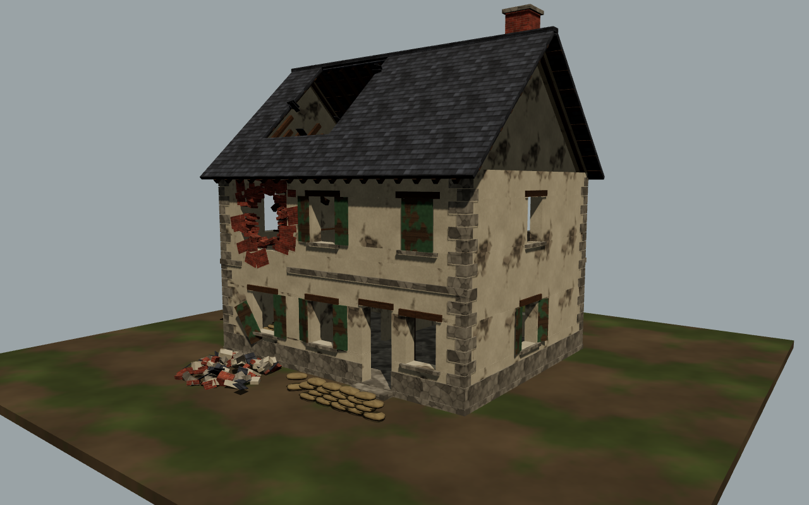
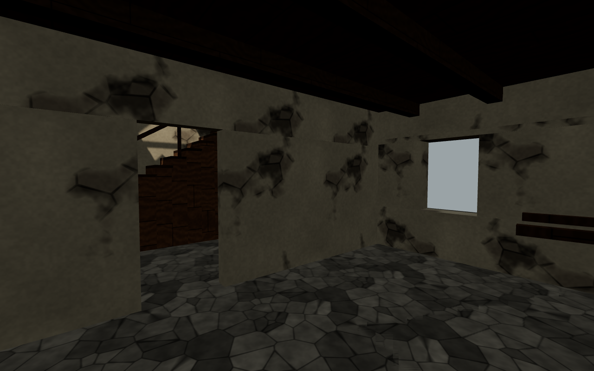
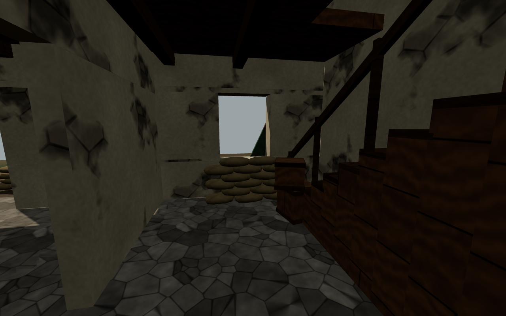
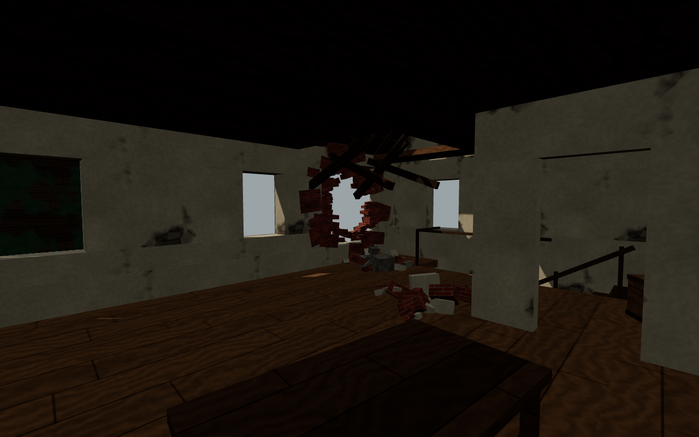

# CoD2 Temalı Bina: Savaşta Hasar Görmüş Normandiya Evi

Unity FPS oyunu için Call of Duty 2 (1944, Carentan) havasında, **içine girilebilen** iki katlı bir taş ev.
İki parçası var:

1. **Prosedürel, oynanabilir bina** (`generator/`): kapılar, merdiven, iç duvarlar ve collider'larla FPS'e hazır OBJ.
2. **[image-blaster](https://github.com/neilsonnn/image-blaster) köprüsü** (`image-blaster/blast.sh`): binanın render'ını image-blaster'a verir. Nano-banana bu render'ı gerçekçi bir CoD2 evi görseline çevirir, Hunyuan 3D de o görselden PBR dokulu bir mesh üretir.



| Zemin kat | MG yuvası | Üst kat |
|---|---|---|
|  |  |  |

## İçerik

- Ölçüler: 10 m × 8 m taban, 2 kat (kat yüksekliği yaklaşık 3,1 m), sırt yüksekliği yaklaşık 10 m. Birim metre, Y yukarı.
- Kapılar 1,1 m × 2,3 m. Merdiven 16 basamaklı (rıht 19 cm, basamak 31 cm), Unity CharacterController'ın varsayılan step offset değeriyle çıkılabiliyor.
- Hasar: üst kat ön duvarında top mermisi deliği (çıkıntılı tuğlalar, dökülmüş sıva), çatıda delik ve kırık mertekler, tavandan sarkan kırık kirişler, moloz yığınları.
- Detaylar: yeşil Fransız panjurlar (açık, kapalı, kırık), taş köşe blokları, kum torbalı MG yuvası, kum torbası barikatı, sandıklar, devrilmiş masa, baca.
- 11.320 üçgen ve 9 malzeme. Her malzeme ayrı bir alt nesne olarak geliyor: `plaster, brick, stone, wood_floor, wood_dark, shutter_green, slate, burlap, ground`.
- Dokular 512 px, tekrarlanabilir (tileable) ve prosedürel olarak üretildi.

## Unity'ye Kurulum

1. `Unity/Assets/CoD2Building` klasörünü projenizin `Assets/` klasörüne kopyalayın.
2. `Editor/CoD2BuildingImporter.cs` import sırasında şunları otomatik yapar:
   - her alt mesh'e **MeshCollider** ekler (Generate Colliders),
   - dokuları Repeat moduna alır,
   - malzemelere aynı isimli dokuyu bağlar (Built-in `_MainTex` ve URP `_BaseMap` desteklenir).
3. Menüden **Tools → CoD2 → Normandiya Evini Sahneye Ekle**'yi seçin. Ev orijine, static olarak yerleşir.
4. Kendi terrain'inizi kullanacaksanız `ground` alt nesnesini silin.

> Dokular atanmamış görünürse modele sağ tıklayıp **Reimport** yapın. Doku dosyaları modelden önce import edilmiş olmalı.
> Unity OBJ'yi X ekseninde aynalayarak alır, yani top deliği diğer tarafta görünür. Bunun oynanışa bir etkisi yok.

## Yeniden Üretme ve Değiştirme

```bash
pip install numpy pillow trimesh
cd generator
python3 build_house.py --out ../Unity/Assets/CoD2Building/Models --glb-dir ../glb --seed 1944
```

Kat planı, pencere ve kapı açıklıkları ile hasar noktaları `build_house.py` dosyasının başındaki sabitlerde tanımlı (`FRONT`, `BACK`, `SHELL_HOLE`, `STAIR_*` ...). `--seed` değerini değiştirince moloz, kırık tuğla ve kum torbası yerleşimi değişir.

Önizleme render'ları (`npm i three@0.169.0 playwright` gerekir):

```bash
cd generator/preview
node render.mjs ../../glb ../../previews '{"on_cephe":"cam=-13,6,-17,0,3.5,0"}'
```

## image-blaster ile Gerçekçi Mesh Üretme

image-blaster tek bir görselden 3D model üretir. Burada girdi olarak binanın beyaz arka planlı render'ını (`previews/referans.png`) kullanıyoruz:

```bash
export FAL_KEY=...            # https://fal.ai
./image-blaster/blast.sh      # varsayılan girdi: previews/referans.png
# ./image-blaster/blast.sh benim_cod2_ekran_goruntum.png   # kendi referans görselinizle
# ./image-blaster/blast.sh --reference-only                # sadece görsel düzenleme adımı
```

Script image-blaster'ı `image-blaster/.image-blaster/` altına klonlar, CoD2'ye özel bir image-edit prompt'u ile `generate-single-asset.mjs` scriptini çalıştırır (Hunyuan 3D, 150k yüz, PBR) ve çıktıları `Unity/Assets/CoD2Building/Blasted/` klasörüne kopyalar. `.glb` dosyasını Unity'de açmak için [glTFast](https://docs.unity3d.com/Packages/com.unity.cloud.gltfast@latest) paketi gerekir.

Not: Hunyuan çıktısı tek parça, içi dolu bir mesh'tir. Bu yüzden arka plan, siper veya uzak bina olarak kullanmaya uygundur. Oyuncunun içine girdiği bina için prosedürel OBJ'yi kullanın.
