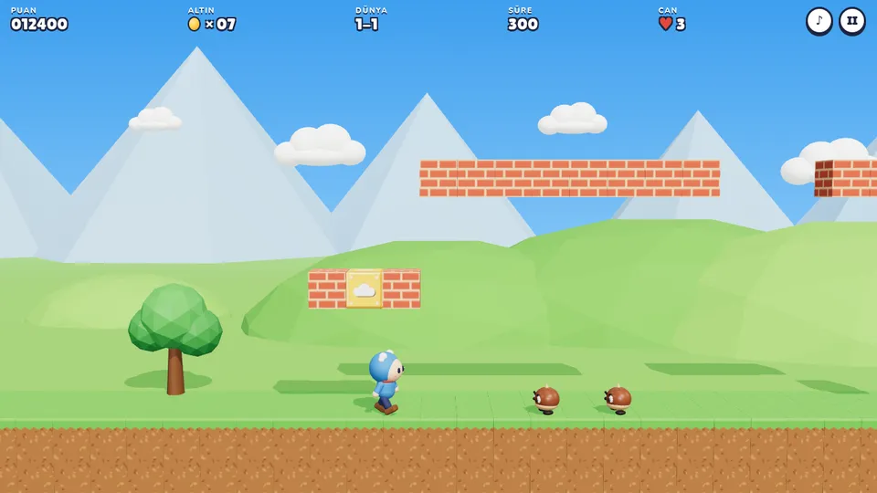

# Süper Bulut

Tarayıcıda oynanan, Süper Mario tarzı 2.5D bir platform oyunu. Three.js ile çizilir. Karakterler, düşmanlar, bloklar ve dekorlar **Meshy AI** ile üretilen 3D modellerden gelir. Modeller henüz üretilmediyse oyun aynı ölçülerde yer tutucu modellerle çalışır. Meshy çıktısı `assets/models/` klasörüne düştüğü anda otomatik olarak kullanılır.



## İçerik

- **3 bölüm:** 1-1 Yeşil Vadi (gündüz), 1-2 Bulut Yolu (gökyüzü), 1-3 Kirpi Kayalıkları (akşam)
- **Bulut:** mavi kapüşonlu kahraman. Simit yiyince büyür ve tuğla kırar. Nazar boncuğu 9 saniye dokunulmazlık verir.
- **Düşmanlar:** kestane (üstüne basılır), kirpi (dikenli, basılmaz; altındaki bloğa vurarak ya da nazarla yenilir), arı (uçar)
- Sürpriz bloklar, çok altınlı tuğlalar, alttan geçilen bulut platformları, bitiş direği, kontrol noktası
- Değişken yükseklikte zıplama, koşma, kenardan düştükten sonra kısa süre zıplayabilme ("coyote time"), zıplama tamponu
- Ses efektleri ve özgün müzik WebAudio ile sentezlenir (ses dosyası yok)
- Klavye, dokunmatik ekran ve oyun kolu desteği; zayıf cihazlarda otomatik kalite düşürme

## Kontroller

| Eylem | Klavye | Dokunmatik | Oyun kolu |
| --- | --- | --- | --- |
| Yürü | ← → veya A D | sol alttaki yön alanı | sol çubuk / yön tuşları |
| Zıpla (basılı tut = daha yüksek) | Boşluk, ↑, W, Z | **A** | A |
| Koş | Shift, X | **B** (basılı tut) | X / B |
| Bulut platformundan in | ↓ veya S | yön alanının altı | aşağı |
| Duraklat | P, Esc | sağ üstteki II | Start |
| Ses | M | sağ üstteki ♪ | |

## Çalıştırma

Oyun derleme gerektirmez. Yalnızca modülleri ve modelleri sunacak bir web sunucusu yeterlidir; `file://` ile açılmaz.

```bash
cd super-bulut
node tools/serve.mjs        # http://localhost:8080
```

**GitHub Pages:** Depo ayarlarında *Settings → Pages → Deploy from a branch* seçip `main` dalını ve `/ (root)` klasörünü seçin. Oyun şu adreste açılır: `https://<kullanıcı-adı>.github.io/bulut/super-bulut/`

## Meshy AI ile 3D modelleri üretmek

### Nasıl çalışır

1. `assets/manifest.json` her varlığın Meshy istemini (prompt), çokgen sayısını ve oyundaki ölçüsünü (`fit`) tanımlar.
2. `tools/meshy-generate.mjs` her varlık için şu adımları izler:
   - Meshy **text-to-3D** ile şekli üretir (önizleme)
   - Dokuları ekler (refine)
   - Oyuncu karakterini **otomatik rigging** ile iskeletlendirir
   - Oyuncuya yürüme, koşma, bekleme, zıplama ve zafer animasyonlarını ekler
3. GLB dosyaları indirilir. Dokular WebP'ye çevrilip küçültülür. Animasyon dosyalarından ağ ve dokular atılır.
4. Sonuç `assets/generated.json` dosyasına yazılır. Oyun açılışta bu dosyayı okur: kayıtlı modeli yükler, olmayanlar için yer tutucuyu kullanır.

İlerleme her adımdan sonra kaydedilir. Betik yarıda kesilirse tekrar çalıştırdığınızda kaldığı görevden devam eder ve aynı adım için ikinci kez kredi harcamaz.

### API anahtarı

Meshy API ücretli planlarda açıktır. Anahtarı [meshy.ai](https://www.meshy.ai) hesabınızdaki API ayarlarından oluşturun. **Anahtarı hiçbir zaman depoya yazmayın.** Betik anahtarı yalnızca `MESHY_API_KEY` ortam değişkeninden okur.

**Seçenek A: Claude Code (bulut ortamı)**

1. Claude Code'da bulut ortamı menüsünden ortamı düzenleyin (*Edit*).
2. Ortam değişkenlerine `MESHY_API_KEY=msy_...` ekleyin.
3. Yeni bir oturum açıp Claude'dan "Meshy modellerini üret" isteyin. Claude betiği çalıştırır, modelleri depoya ekler ve gönderir (push).

**Seçenek B: Kendi bilgisayarınızda (Node 18+)**

```bash
cd super-bulut
npm install                       # GLB küçültme için (isteğe bağlı ama önerilir)
npm run assets:plan               # ne üretileceğini ve tahmini krediyi gösterir
MESHY_API_KEY=msy_... npm run assets
```

Windows PowerShell: `$env:MESHY_API_KEY="msy_..."; npm run assets`

Üretim bitince `assets/models`, `assets/thumbs` ve `assets/generated.json` dosyalarını commit'leyin. Meshy dosyaları kendi sunucusunda yalnızca birkaç gün saklar; betik dosyaları hemen indirir.

### Tahmini kredi

Meshy fiyat listesine göre: önizleme 20 kredi (`meshy-6-lite` ile 5), doku 10 kredi, rigging 5 kredi, animasyon başına 3 kredi.

| Varlık | Model | Adımlar | Kredi |
| --- | --- | --- | --- |
| Oyuncu | latest | önizleme + doku + rigging + 3 animasyon | 44 |
| Düşmanlar, eşyalar, kule (7 varlık) | latest | önizleme + doku | 7 × 30 = 210 |
| Bloklar ve dekorlar (11 varlık) | meshy-6-lite | önizleme + doku | 11 × 15 = 165 |
| **Toplam** | | | **~419** |

Her varlık `manifest.json` içinde kendi `ai_model` değerini taşıyabilir; yazılmamışsa üstteki `meshy.ai_model` kullanılır. Hepsini `latest` yaparsanız toplam ~584 kredi olur. Betik başlamadan önce bakiyenizi kontrol eder ve onayınızı ister.

### Seçenekler

```bash
node tools/meshy-generate.mjs --list                     # varlıklar ve durumları
node tools/meshy-generate.mjs --only player,kestane      # yalnızca seçilenler
node tools/meshy-generate.mjs --only coin --force        # yeniden üret
node tools/meshy-generate.mjs --yes --concurrency 4      # onay sormadan, 4 paralel
node tools/meshy-generate.mjs --no-optimize              # dokuları küçültme
```

### Modeli beğenmediyseniz

- `manifest.json` içinde varlığın `prompt` alanını değiştirin. Betik değişen istemleri algılar ve bir sonraki çalıştırmada yeniden üretir.
- Model ters yöne bakıyorsa `rotationY` değerini derece cinsinden değiştirin (ör. `90`, `180`). Modeller kameraya (+Z) bakmalıdır.
- Boyut `fit` alanıyla ayarlanır:
  - `"height"`: yüksekliği bu kadar blok yapar.
  - `"width"`: genişliği bu kadar blok yapar.
  - `"box"`: modeli verilen kutuya sığdırır; bloklar için `[1, 1, 1]` kullanılır.
- Oyuncunun rigging'i başarısız olursa model iskeletsiz kullanılır ve gövdeyle zıplayarak yürür.

## Kendi bölümünü yap

Bölümler `src/levels.js` içinde metin olarak çizilir. Her bölüm 15 satır yüksekliğinde parçalardan oluşur. Parçalar yan yana eklenir.

```
.  boş                 #  toprak (üstü otomatik çimenli olur)
B  tuğla               C  çok altınlı tuğla
?  sürpriz: altın      M  sürpriz: simit      N  sürpriz: nazar
S  taş blok            =  bulut platformu
o  altın               P  başlangıç noktası
F  bitiş direği        K  kule (bölüm sonu)
k  kestane             h  kirpi               a  arı
T  ağaç                b  çalı
```

Zıplama yüksekliği yürürken yaklaşık 4, koşarken 5 bloktur. Yürüyerek 4, koşarak 8 bloğa kadar boşluk atlanabilir.

## Dosya yapısı

```
super-bulut/
├── index.html, style.css      arayüz (başlık ekranı, puan tablosu, dokunmatik tuşlar)
├── src/
│   ├── main.js                oyun döngüsü, durumlar ve kurallar
│   ├── world.js               sahne, ışık, bloklar, arka plan, kamera
│   ├── assets.js              Meshy GLB / yer tutucu yükleme ve ölçekleme
│   ├── placeholders.js        prosedürel yer tutucu modeller
│   ├── player.js, enemies.js, items.js
│   ├── physics.js, level.js, levels.js, config.js
│   └── audio.js, input.js, hud.js, effects.js, animator.js
├── assets/
│   ├── manifest.json          varlık tanımları ve Meshy istemleri
│   ├── generated.json         üretilen modellerin kaydı (betik yazar)
│   ├── models/                Meshy GLB dosyaları
│   └── thumbs/                model önizleme görselleri
└── tools/
    ├── meshy-generate.mjs     Meshy üretim betiği
    ├── lib/meshy.mjs          Meshy API istemcisi
    ├── lib/glb.mjs            GLB küçültme
    └── serve.mjs              yerel sunucu
```

Meshy ile üretilen modellerin kullanım hakları Meshy hesabınızın plan koşullarına tabidir.
